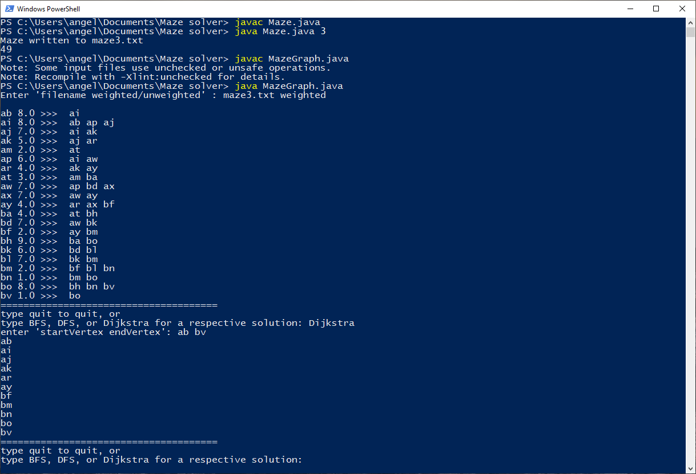

# Maze solver

Authors: Angel Villa, Qimeng Yu

Maze solver using BFS, DFS, and Dijkstra's algorithm to find shortest paths for weighted and unweighted mazes.

1. Run 'javac Maze.java'
2. Run 'java Maze.java [size]'
3. Compile and run MazeGraph.java to solve a maze. You will need to input

    a) 
    
        maze#.txt weighted
    
       __or__
       
       maze#.txt unweighted
       
    b) 
    
        quit
    
       __or__
       
       BFS
       
       __or__
       
       DFS
       
       __or__
       
       Dijkstra
       
    c) 
    
        startVertexLabel endVertexLabel
    
       (e.g. 'ab db' as listed on VertexList, verify solution with maze4.txt file)
    
 Example
 ------
 
 maze3.txt (size = 3)
 
 7 7
 
 aa0 ab8 ac0 ad0 ae0 af0 ag0 
 
 ah0 ai8 aj7 ak5 al0 am2 an0 
 
 ao0 ap6 aq0 ar4 as0 at3 au0 
 
 av0 aw7 ax7 ay4 az0 ba4 bb0 
 
 bc0 bd7 be0 bf2 bg0 bh9 bi0 
 
 bj0 bk6 bl7 bm2 bn1 bo8 bp0 
 
 bq0 br0 bs0 bt0 bu0 bv1 bw0 
 
 